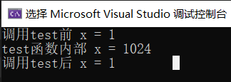
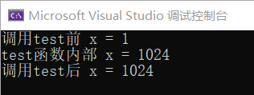

# 第二章 线性表

## 1.线性表的定义

线性表示具有==相同数据类型==的n个数据元素的有限==序列==。n为表长，当n=0，线性表是一个空表。

用L命名线性表，L=（a~1~,a~2~,...,a~i~,a~i+1~,...,a~n~)

注：a~i~是线性表中的“第i个”元素线性表的==位序==

<u>位序是从1开始，数组下标是从0 开始</u>

a~1~是表头元素，a~n~是表尾元素

除第一个元素外，每个元素==有且只有==一个直接前驱；

除最后一个元素外，==有且只有==一个直接后继

## 2.线性表的基本操作

==记忆点：创销，增删改查==

InitList(&L)==初始化表==：构建一个空的线性表L，分配内存空间

DestroyList(&L)==销毁表==：销毁线性表，并释放线性表L所占的内存空间

ListInsert(&L,i,e)==插入==：在表L中第i个位置上插入指定元素e

ListDelete(&L,i,&e)==删除==：删除表L中第i个位置的元素，并用e返回删除元素的值

LocateElem(L,e)==按值查找==：在表L中查找具有具有给定关键字值的元素

GetElem(L,e)==按位查找==：在表L中获取第i个位置的元素的值

其他常用操作：

Length(L)==求表长==：返回线性表L的长度，即L中数据元素的个数

PrintList(L)==输出==：按前后顺序输出线性表L的所有元素值

Empty(L)==判空==：若表L为空表，返回ture,否则返回false

注：“&”传入引用 对参数的修改结果需要  传回来

没有传回x

```c++
#include<stdio.h>

void test(int x) {
	x = 1024;
	printf("test函数内部 x = %d\n", x);
}
int main() {
	int x = 1;
	printf("调用test前 x = %d\n", x);
	test(x);
	printf("调用test后 x = %d\n", x);
}
```



传回x

```c++
#include<stdio.h>

void test(int &x) {
	x = 1024;
	printf("test函数内部 x = %d\n", x);
}
int main() {
	int x = 1;
	printf("调用test前 x = %d\n", x);
	test(x);
	printf("调用test后 x = %d\n", x);
}
```




